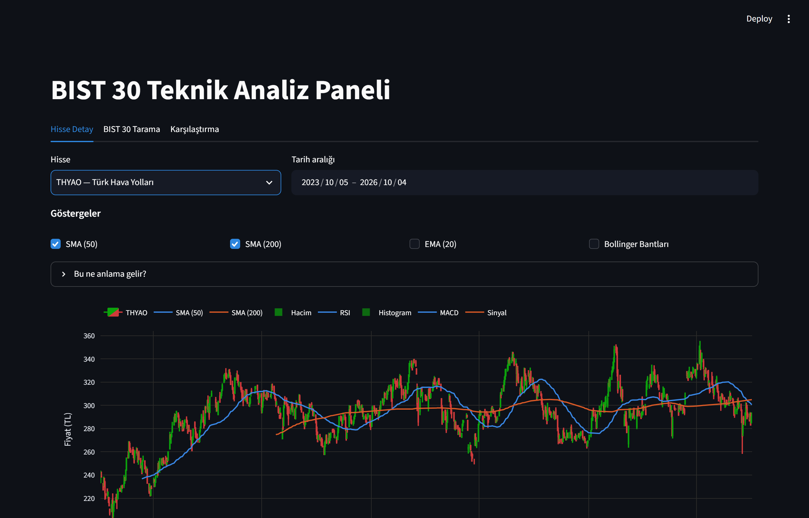
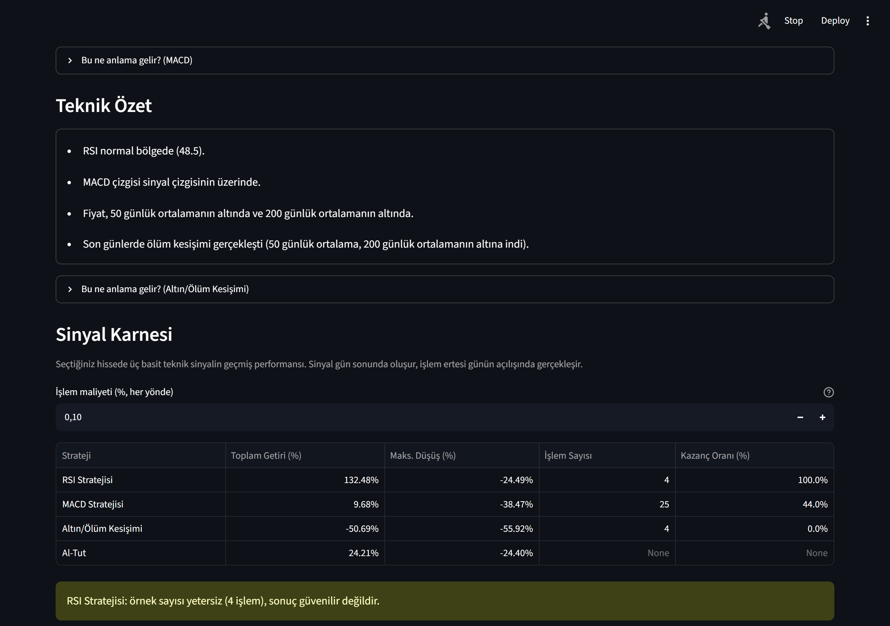

# BIST 30 Teknik Analiz Paneli

Borsa İstanbul'daki BIST 30 endeksi hisseleri için teknik analiz göstergelerini
görselleştiren, Streamlit ile yazılmış Türkçe bir web uygulaması.



## English summary

A Turkish-language technical analysis dashboard for Turkey's BIST stocks,
built with Streamlit. It fetches daily OHLCV data from Yahoo Finance and
computes SMA, EMA, RSI (Wilder's method), MACD and Bollinger Bands from
scratch with pandas/numpy (no third-party TA library). Three tabs: a
single-stock detail view — searchable across all ~790 Borsa İstanbul-listed
companies, not just the top 30 — with candlestick charts, a plain-language
technical summary, a TL/USD currency toggle, and a **"Sinyal Karnesi"**
section that backtests three simple long-only signals (RSI oversold/
overbought, MACD crossover, 50/200 SMA golden/death cross) with strict
no-look-ahead execution (signal at close, trade at next day's open) and
configurable transaction costs; a sortable/filterable screener for the
BIST 30 constituents with a daily-change heatmap; and a multi-stock
comparison view with normalized returns and a correlation heatmap.
Educational project — not investment advice.

## Özellikler

### 📈 Hisse Detay
- Borsa İstanbul'da işlem gören **~790 hissenin tamamında** sembol veya şirket adıyla arama (sadece BIST 30 değil); listede bulamadığınız bir sembolü elle de girebilirsiniz
- Mum grafiği + hacim, üzerine aç-kapa yapılabilen SMA(50)/SMA(200)/EMA(20)/Bollinger Bantları
- Altta ayrı paneller halinde RSI ve MACD
- **TL / USD görünüm anahtarı** — fiyatlar ve tüm göstergeler USDTRY kuruyla gerçek zamanlı dönüştürülür (kur etkisinden arındırılmış performans için)
- **Teknik Özet** kartı: RSI bölgesi, MACD kesişimi, fiyatın hareketli ortalamalara göre konumu, altın/ölüm kesişimi — tamamen tarafsız dille, "AL/SAT" ifadesi hiç kullanılmaz
- Her gösterge yanında "Bu ne anlama gelir?" açılır açıklama kutusu

### 🎯 Sinyal Karnesi (backtest)


Hisse Detay sekmesinin içinde, üç basit teknik sinyalin **geçmiş performansını** gösteren bölüm:
- RSI(14) aşırı satım/alım, MACD kesişimi, SMA 50/200 altın/ölüm kesişimi — ve "Al-Tut" karşılaştırması
- **İleriye bakış (look-ahead) hatası yok**: sinyal bir günün kapanışında oluşur, işlem ancak ertesi günün açılışında gerçekleşir
- Sabit, hisseye özel optimize edilmemiş parametreler; sadece uzun (long) pozisyon, kaldıraç yok
- Ayarlanabilir işlem maliyeti (varsayılan %0,1, her yönde)
- Bedelsiz sermaye artırımı/temettü düzeltmeli fiyatlarla hesaplanır
- Toplam getiri, maksimum düşüş, işlem sayısı, kazanç oranı; getiri eğrileri karşılaştırması; fiyat grafiğinde işaretlenmiş giriş/çıkış noktaları
- İşlem sayısı 10'un altındaysa "örnek sayısı yetersiz" uyarısı

### 🔍 BIST 30 Tarama
- Tüm 30 hisse için tek bakışta: son fiyat, günlük % değişim, RSI, trend durumu
- Günlük değişime göre renklendirilmiş ısı haritası
- Sütun başlığına tıklayarak sıralama, trend durumuna ve hisse/şirket adına göre filtreleme

### ⚖️ Karşılaştırma
- Borsa İstanbul'daki tüm hisseler arasından 2 ile 5 arasında seçip aynı grafikte karşılaştırın
- Başlangıcı 100 kabul eden normalize edilmiş getiri grafiği (farklı fiyat seviyelerindeki hisseleri adil karşılaştırmak için)
- Seçilen hisselerin günlük getirileri arasındaki korelasyon ısı haritası

## Kurulum

```powershell
git clone https://github.com/mehmet-yuksell/bist30-teknik-analiz-paneli.git
cd bist30-teknik-analiz-paneli
python -m venv venv
.\venv\Scripts\Activate.ps1
pip install -r requirements.txt
streamlit run app.py
```

Uygulama `http://localhost:8501` adresinde açılır.

## Testler

```powershell
pytest tests/ -v
```

`indicators.py` içindeki SMA, EMA, RSI ve MACD hesaplamaları, elle (kapalı
formülle) doğrulanmış küçük örnek verilerle test edilir.

## Streamlit Community Cloud'a Dağıtım

1. Projeyi GitHub'a push edin (bkz. yukarıdaki kurulum adımları / commit geçmişi)
2. [share.streamlit.io](https://share.streamlit.io) adresine GitHub hesabınızla giriş yapın
3. "New app" düğmesine tıklayın
4. Repository, branch (`main`) ve ana dosya olarak `app.py` seçin
5. "Deploy" düğmesine tıklayın — birkaç dakika içinde uygulamanız yayında olur

## Proje Yapısı

```
app.py            Streamlit arayüzü (3 sekme)
config.py         BIST 30 hisse listesi (son güncelleme tarihiyle birlikte)
data.py           Yahoo Finance'den veri çekme, önbellekleme, hata yönetimi
indicators.py     SMA, EMA, RSI (Wilder), MACD, Bollinger Bantları — sıfırdan
signals.py        Gösterge değerlerinden tarafsız Türkçe gözlem metinleri
backtest.py       Sinyal Karnesi: look-ahead içermeyen basit backtest motoru
ui_text.py        Tüm arayüz metinleri (tek merkezden yönetim)
data/bist_all.csv KAP kaynaklı, Borsa İstanbul'daki tüm şirketlerin listesi
tests/            pytest testleri
```

## Teknoloji

Python 3.11+, Streamlit, yfinance, pandas, numpy, plotly, pytest. Teknik
göstergeler hazır bir kütüphane (ör. pandas-ta) kullanılmadan, pandas/numpy
ile sıfırdan yazılmıştır.

## Sınırlamalar

- **BIST 30 listesi sabittir.** Endeks bileşenleri üç ayda bir değişebilir;
  bu projedeki liste `config.py` içinde belirtilen tarihte doğrulanmıştır ve
  otomatik güncellenmez.
- **Veriler gecikmelidir.** Yahoo Finance üzerinden alınan fiyatlar gerçek
  zamanlı değildir.
- **Eğitim amaçlıdır, yatırım tavsiyesi değildir.** Göstergeler yalnızca
  geçmiş fiyat hareketlerine dayanır ve geleceği garanti etmez.
- **Tek veri kaynağına bağımlıdır.** Yahoo Finance'in erişilemediği
  durumlarda veri gelmeyebilir (uygulama bu durumda çökmez, anlaşılır bir
  hata mesajı gösterir).
- **BIST 30 Tarama her zaman sadece 30 hisseyi gösterir.** Hisse Detay ve
  Karşılaştırma'daki geniş arama (tüm Borsa İstanbul) bilinçli olarak bu
  sekmeye uygulanmadı; yüzlerce hisseyi tek seferde çekmek Yahoo
  Finance'in hız sınırlarına takılabilir.
- **Sinyal Karnesi gerçek bir yatırım stratejisi değildir, basitleştirilmiş
  bir eğitim modelidir.** Vergi, kayma (slippage) ve likidite dikkate
  alınmaz; parametreler sabittir ve hisseye özel optimize edilmemiştir;
  geçmiş performans gelecek için garanti değildir. Az sayıda sinyal
  üreten dönemlerde (özellikle altın/ölüm kesişimi gibi nadir sinyallerde)
  sonuçlar istatistiksel olarak güvenilir olmayabilir — bu durumda
  uygulama açıkça uyarır.
- **TL/USD dönüşümü yalnızca Hisse Detay grafiğine uygulanır**, Sinyal
  Karnesi her zaman TL bazlı hesaplanır.

---

*Yatırım tavsiyesi değildir. Veriler Yahoo Finance üzerinden alınır ve
gecikmeli olabilir. Eğitim amaçlı bir projedir.*
